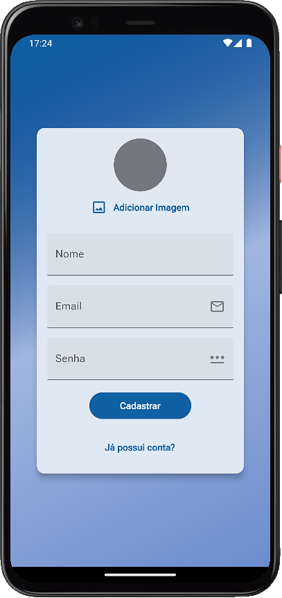
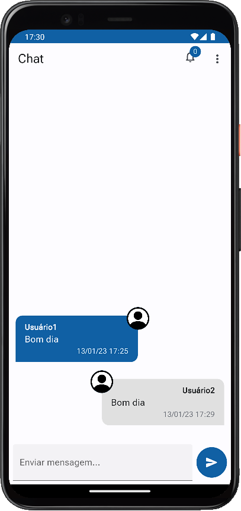
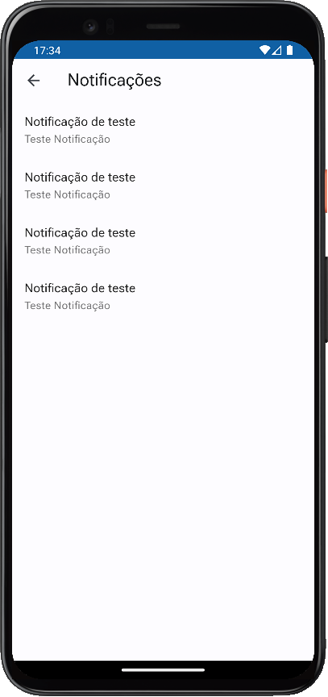

# chat-app

<p align="left">
    
   <!--     -->
   
</p>

App de chat integrado com Firebase e Firestore para armazenamento dos dados de usuários e do aplicativo. App desenvolvido com a linguagem Dart e framework Flutter.

## :hammer: Funcionalidades do projeto
* `Autenticação:` tela de login e cadastro de usuários, com nome, email e senha.
* `Upload de Imagens:` upload dos avatares dos usuários.
* `Persistencia das mensagens:` mensagens salvas no Firestore.
* `Push Notifications:` envio de push notifications.

<br>
<div display: inline_block align="center">
   
   
   
</div>

## :file_folder: Acesso ao projeto
Você pode [acessar o código-fonte do projeto](https://github.com/GabrielSchiavo/chat-app) ou [baixá-lo](https://github.com/GabrielSchiavo/chat-app/archive/refs/heads/main.zip).

## :hammer_and_wrench: Abrir e rodar o projeto
Após baixar o projeto, você pode abrir com o Visual Studio Code. Para o projeto funcionar você deve ter configurado em seu PC:

* Flutter - Versão >=2.18.2 <3.0.0
* SDK Android - API >= 19

Abra um terminal na pasta raiz do projeto e execute estes comandos:
```bash
dart pub get
```
```bash
flutter pub get
```

* `Configurando os SDKs do Firebase:`
Acesse a documentação oficial do Firebase em https://firebase.google.com/docs/android/setup. Nos arquivos do projeto encontre todas as ocorrências de "com.exemple.app" e substitua por um ID de pacote único de sua escolha.

<!-- * `No Console do Firebase:` configure o serviço de "Authentication" para o método de login com "E-mail/senha", o "Storage", o "Messaging" e configure e altere também as regras do "Firestore Database" para:
```bash
rules_version = '2';
service cloud.firestore {
  match /databases/{database}/documents {
    match /{document=**} {
      allow read
      allow write
    }
  }
}
``` -->

Agora ao abrir o projeto com o Visual Studio Code, abra o arquivo "main.dart" localizado na pasta "lib", agora pode executar ou depurar no seu smartphone, em um emulador Android ou iOS, no Windows ou no navegador.

## :white_check_mark: Tecnologias utilizadas
* `Dart - 2.18.2`
* `Flutter - 3.3.6`
* `Firebase`
* `Firestore`
* `image_picker - 0.8.6`
* `provider - 6.0.5`
* `intl - 0.17.0`
* `firebase_core - 2.4.1`
* `cloud_firestore - 4.3.1`
* `firebase_auth - 4.2.5`
* `firebase_storage - 11.0.10`
* `firebase_messaging - 14.2.1`
* `Material Design 3`
